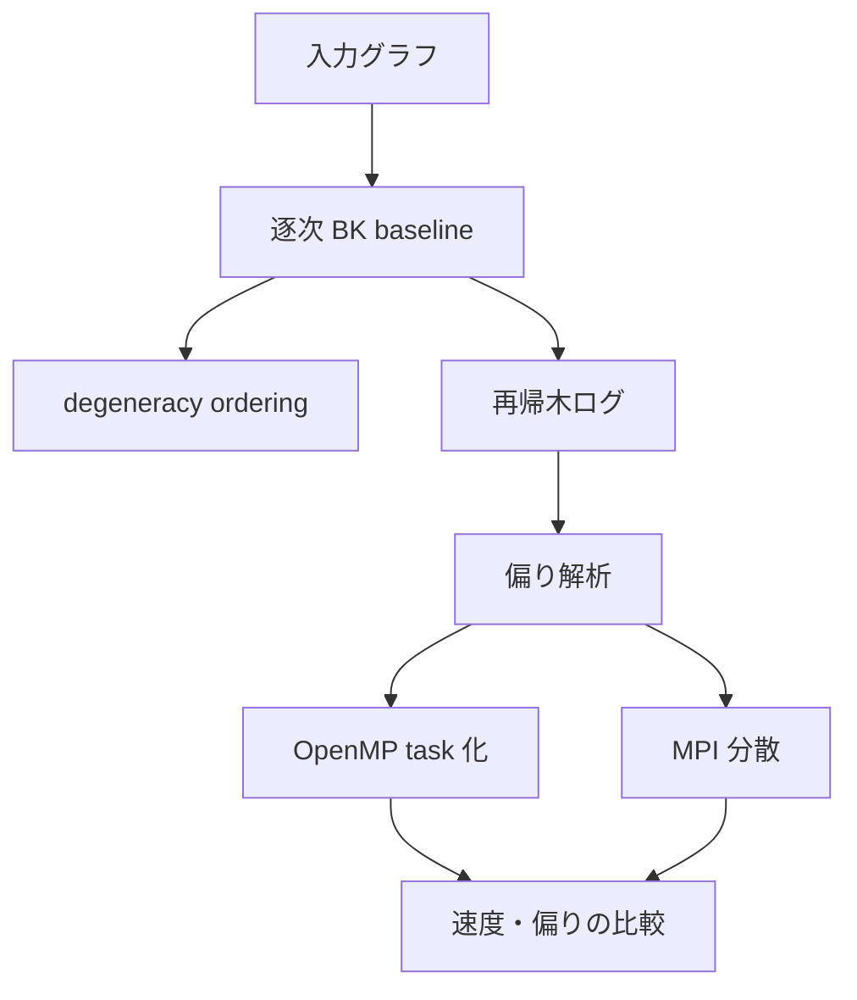

# BK 法と並列化の基礎知識

この文書は、Bron–Kerbosch 法、OpenMP、MPI、分散処理、並列化をまだ知らない前提で、このリポジトリを読み進めるために必要な最低限の知識をまとめた入口です。

ここでは「理論を完全に説明する」ことよりも、「このリポジトリのどのファイルを読めば何が分かるか」と「修論の題材としてどこが論点になるか」を優先します。

## この文書の使い方

この文書は、次の 3 段階で読むと理解しやすいです。

1. 用語を確認する
2. BK 法・OpenMP・MPI の役割を理解する
3. 修論で何を比較・評価すべきかを確認する

## まず読む順番

1. [docs/week0_foundation_modules.md](week0_foundation_modules.md)
2. [docs/sequential_bron_kerbosch.md](sequential_bron_kerbosch.md)
3. [docs/degeneracy_ordering.md](degeneracy_ordering.md)
4. [docs/recursion_tree_logging.md](recursion_tree_logging.md)
5. [docs/openmp_taskization.md](openmp_taskization.md)
6. [docs/mpi_task_distribution.md](mpi_task_distribution.md)

この順番にすると、「基盤の部品」→「逐次 BK」→「探索順の工夫」→「ログで観測」→「OpenMP」→「MPI」という流れで理解しやすくなります。

## この研究で最初に確認すべき問い

このテーマでは、最初から「どう速くするか」を考えるより、次の問いを押さえる方が重要です。

- どの入力で探索木が偏るのか
- 逐次で効く工夫が並列でも効くのか
- どの深さで task 化すると得か損か
- 通信や同期がどこで効いてくるのか
- 単純な並列化と研究として意味のある並列化の差は何か

この 5 つが、後の実験設計の骨格になります。

## 実験の進め方

このテーマでは、まず逐次版を小さいグラフで動かして、極大クリークの出力が正しいかを確認します。ここが曖昧だと、後で OpenMP や MPI に進んでも比較の土台が崩れます。

次に、再帰木ログを使って探索木の偏りを観測します。見るべきなのは、単なる総実行時間ではなく、`depth` ごとの `elapsed_us`、`p_size` の分布、`child_count` のばらつきです。必要なら `node_id` と `parent_id` から子孫合計時間を計算して、どの枝が重いかを追います。

その後、OpenMP の task 化を試します。ここでは、`task_depth` を変えて、逐次版との差と偏りの変化を見ます。もし task 化で速くなっても、偏りが残るなら、単に並列化しただけでなく分割条件を詰める余地があります。

最後に MPI に進みます。MPI では、浅い部分木をどう配るかが重要なので、round-robin 配布を基準にして、重み付き配布や別の切り方と比べます。通信コストがあるため、OpenMP と同じ感覚で「もっと細かく分ければよい」とは限りません。

この順番で進める理由は、次の 4 点を順に固定するためです。

- 正しさ
- 観測
- 単一ノード並列
- 分散並列

この順を守ると、どの段階で何が改善したのかを説明しやすくなります。

より手順を厳密に追いたい場合は [docs/experiment_playbook.md](experiment_playbook.md) を見てください。ここには、逐次 BK を回してから解析し、OpenMP と MPI に進む最小の実験順が書いてあります。

## 全体像の図

この図の意味は単純です。まず逐次で正しい探索木を観測し、その観測結果をもとに OpenMP や MPI の分割条件を決めます。

## 1. まず知っておくべき言葉

### グラフ

頂点と辺からなる構造です。このリポジトリでは、頂点番号は通常 0 から始まる整数で扱います。

### クリーク

ある頂点集合の中で、どの 2 頂点も必ず辺で結ばれている集合です。

### 極大クリーク

これ以上 1 頂点も追加できないクリークです。最大サイズのクリークとは違い、「サイズ最大」ではなく「追加不能」で判定します。

### 列挙

1 個だけ見つけるのではなく、条件を満たすすべての対象を出します。極大クリーク列挙では、出力数自体が多くなることがあります。

### 負荷均衡

並列処理では、各スレッドや各 rank にできるだけ同じ量の仕事を割り当てたいです。実際には、探索木の形が偏るので、同じ仕事量にはなりません。

### task

OpenMP で「この部分を後で別スレッドに実行させる」という単位です。細かく分けすぎると管理コストが増えます。

### rank

MPI でのプロセス番号です。共有メモリの「スレッド」とは違い、rank 同士はメモリを共有しません。

### frontier

BFS 系で、今まさに展開する境界の頂点集合を指します。このリポジトリでは BFS ベースの実験コードでも使われています。

## 2. Bron–Kerbosch 法の最小理解

BK 法は、再帰を使って極大クリークを列挙する手法です。

BK 法の基本的な見方は、「今のクリークに追加できる頂点を試しながら、追加できなくなったら答えとして出す」です。

BK 法では次の 3 つの集合を使います。

- `R`: すでに選んだ頂点集合
- `P`: これから候補にできる頂点集合
- `X`: すでに除外した頂点集合

基本的な考え方は、`R` に頂点を 1 つずつ足しながら、`P` と `X` を更新して探索を進めることです。

### 再帰の流れ

1. `P` と `X` が空なら、`R` は極大クリークなので出力する
2. `P` の各頂点 `v` を 1 つ試す
3. `R` に `v` を入れ、`P` と `X` を `v` の近傍で絞る
4. 再帰する
5. 元の呼び出しに戻ったら `v` を `P` から外し、`X` に入れる

この「`P` から 1 つ選んで進む」という再帰構造が、後で task 化や部分木分割の対象になります。

### pivot とは

pivot は、探索を減らすために「今の候補の中から代表の頂点を 1 つ選ぶ」考え方です。pivot を使うと、無駄な枝を減らせることがあります。

このリポジトリの現在の逐次 BK は pivot なしの baseline です。まずは単純版を理解してから、pivot 版に進む方がバグを切り分けやすいです。

### なぜ pivot が研究上の論点になるのか

pivot は多くの枝を削れる一方で、探索木の形も変えます。つまり、

- 逐次では速くなる可能性が高い
- しかし並列では、削減された枝の分布が変わり、負荷偏りも変化する

ので、単純に「pivot ありは良い」とは言えません。

### degeneracy ordering とは

degeneracy ordering は、頂点を「残っている近傍数が小さい順」に並べる前処理です。

逐次では探索量を減らすのに有効ですが、並列では必ずしもそのまま有利とは限りません。ここが研究上の重要な観点です。

### なぜ degeneracy ordering が重要か

degeneracy ordering は、探索の起点や枝の広がり方に影響します。

- 入力グラフの局所密度が高い部分を後ろに回しやすい
- 逐次では探索量削減の効果が出やすい
- ただし並列では「浅いところに重い部分木が集中する」こともある

そのため、並列研究では「前処理として正しいか」だけでなく、「並列負荷分散としても有利か」を見る必要があります。

## 3. 再帰木と偏り

BK 法は再帰木として見ることができます。

- 深い部分木が 1 つだけ重いと、並列化しても一部のスレッドだけが長く働くことがあります
- これを負荷不均衡と呼びます
- 探索木の形を観測して、どこが重いかを調べるのがこのリポジトリの目的の 1 つです

このため、[docs/recursion_tree_logging.md](recursion_tree_logging.md) のログが重要になります。

### 何を見れば偏りが分かるか

偏りを知るには、単に「合計時間」だけを見るのでは足りません。次を一緒に見る必要があります。

- 深さごとのノード数
- 深さごとの `elapsed_us`
- `|P|` の分布
- 子ノード数の分布
- 根からどの枝が重くなったか

つまり、探索木は「何本枝があるか」より「どこに重い枝が偏るか」を見る対象です。

## 4. OpenMP の最小理解

OpenMP は、1 台の計算機の中で複数スレッドを使うための仕組みです。

OpenMP の特徴は、メモリを共有したまま並列化できることです。その代わり、共有データの更新競合に注意する必要があります。

このリポジトリでは主に次を使います。

- `parallel`
- `single`
- `task`
- `critical`

最初に理解すべきことは、「どの処理をスレッドに分けるか」と「小さすぎる仕事を分けすぎると逆に遅くなる」です。

### OpenMP で見るべき評価軸

- スレッド数を増やしたときに speedup が出るか
- task 粒度を変えたときにオーバーヘッドがどう変わるか
- 負荷偏りが小さくなるか
- ログ収集込みでも実験可能か

OpenMP は共有メモリなので、同じ配列やログに複数スレッドが同時に触ると競合します。そのため、`critical` や task の作り方に注意が必要です。

### 修論での使い方

OpenMP の段階では、「並列化しました」だけでは弱いです。

研究としては、

- どの深さから task にするか
- どの特徴量で task を作るか
- どの入力で偏りが顕著か

を比較して、理由を説明できる必要があります。

関連: [docs/openmp_taskization.md](openmp_taskization.md)

## 5. MPI の最小理解

MPI は、複数プロセスや複数台の計算機でデータをやり取りする仕組みです。

MPI は OpenMP よりも、分割した後の通信設計が難しくなります。プロセス間でメモリを共有できないため、状態を明示的に送る必要があります。

OpenMP が「1 台の中の並列」なら、MPI は「プロセス間通信」を伴う並列です。

このリポジトリでは、まずは探索木の浅い部分を分割して各 rank に配る考え方を試しています。

MPI で重要なのは次です。

- `rank`: どのプロセスかを表す番号
- `MPI_Send` / `MPI_Recv`: データ送受信
- `MPI_Barrier`: 全員そろうまで待つ同期

OpenMP より難しいのは、通信の設計そのものが性能に効くことです。単純に分けるだけでは速くならないことが多いです。

### MPI で見るべき評価軸

- どの深さでサブ問題を切ると配りやすいか
- 通信量がどれだけ増えるか
- rank 間の処理時間差がどれだけ縮むか
- round-robin と重み付き配布の差があるか

### 修論での使い方

MPI を研究に使うなら、「分散化できました」だけではなく、

- どの木構造を送るのが効率的か
- どの特徴量で重さを見積もれるか
- 通信コストと負荷均衡のトレードオフはどうか

まで説明できると、研究としての筋が通りやすくなります。

関連: [docs/mpi_task_distribution.md](mpi_task_distribution.md)

## 6. 並列化でよくある失敗

### 1. 仕事の分け方が悪い

仕事を細かくしすぎると、管理コストが勝ちます。

### 2. 偏りを見ていない

平均性能だけ見ても、どのスレッドや rank が詰まっているかは分かりません。

### 3. 逐次で良い順序が並列でも良いと思ってしまう

探索順や ordering は、逐次最適と並列最適が一致しないことがあります。

### 4. ログが足りない

あとから原因を説明できないと、研究として弱くなります。

### 5. 評価指標が足りない

速度だけでは不十分です。少なくとも次を分けて測る必要があります。

- 実行時間
- speedup
- 並列効率
- ログ出力オーバーヘッド
- 負荷偏りの指標

## 7. このリポジトリで最初に押さえる実装

- [include/exp/graph.hpp](../include/exp/graph.hpp)
- [include/exp/bitset.hpp](../include/exp/bitset.hpp)
- [include/exp/bron_kerbosch.hpp](../include/exp/bron_kerbosch.hpp)
- [include/exp/recursion_tree_logger.hpp](../include/exp/recursion_tree_logger.hpp)
- [include/exp/degeneracy.hpp](../include/exp/degeneracy.hpp)

この 5 つを押さえると、逐次 BK、ログ、OpenMP、MPI の位置づけが見えやすくなります。

## 8. 修論としてどう使うか

このリポジトリの価値は、単に並列実装を置くことではなく、BK の探索木を観測して並列化の判断材料にできるところにあります。

修論では、次の順に話を組み立てると筋が通りやすいです。

1. 逐次 BK の正しさを固定する
2. ログで探索木の偏りを測る
3. OpenMP で浅い部分木を task 化する
4. どの入力で偏りが強いかを比較する
5. MPI で分散したときに同じ偏りがどう変わるかを見る

このとき、研究として強いのは「並列化できた」ことではなく、「逐次で有効だった工夫が並列でどう変質するか」を説明できることです。

逆に弱いのは、並列化したが偏りの説明ができず、どの入力で効いたのかも曖昧なまま終わることです。

## 9. 修論として見るなら何が論点か

このテーマでは、「並列化した」だけでは研究として薄くなりやすいです。修論で意味を持たせるには、次のいずれか、できれば複数を示す必要があります。

- 探索木の偏りを定量的に示す
- その偏りを元に task 生成や配布を改善する
- 改善した結果が特定の入力で有効だと示す
- 逐次最適な ordering と並列最適な ordering が違うことを示す

つまり、このリポジトリの研究価値は、単なる実装ではなく「BK の探索木を観測し、それに応じて並列化を設計する」点にあります。

## 10. 今後やるべきこと

このリポジトリを修論に使うなら、優先順位はおおむね次の通りです。

1. 逐次 BK の正しさを固定する
	- 小さいグラフのテストを増やす
	- 逐次版の入出力とログ形式を安定させる
2. 再帰木ログを十分に集める
	- 複数の入力グラフで `depth`, `|P|`, `elapsed_us` を記録する
	- ログ有無のオーバーヘッドを確認する
3. 偏りの指標を決める
	- 深さごとの時間集中
	- 子ノード数のばらつき
	- 1 本の重い枝の有無
4. OpenMP の task 化を評価する
	- `task_depth` を振って speedup と偏りを比較する
	- 入力ごとの差を整理する
5. MPI 分散を検討する
	- 浅い部分木の切り方を変える
	- round-robin と重み付き配布を比較する

この順番を崩すと、先に複雑な並列化だけが増えて、何が効いたのか説明しづらくなります。
