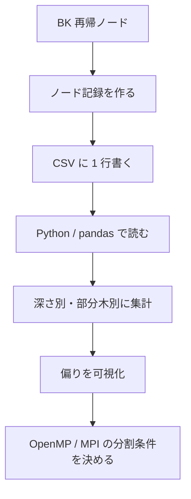

# 再帰木ログ（Recursion Tree Logging）説明書

この文書は、Bron–Kerbosch 実装で出力される再帰木 CSV ログの設計、用途、解析方法、及びログを追加・改訂する際のルールをまとめたものです。

## 全体像



このログは、単なるデバッグ出力ではありません。並列化の分割条件を決めるための実験データです。

## 目的

- BK の各再帰ノードで「どれだけ時間を使っているか」「候補集合の大きさがどうなっているか」を記録し、探索木の偏り（負荷分布）を定量的に示す。
- ログを用いて、どの深さやどの起点が重いかを見つけ、OpenMP や MPI での分割基準（深さ閾値や `|P|` 閾値）を決める。

## 出力フォーマット

CSV ヘッダ（列順）:

- `node_id` : ノードの一意 ID（0 から連番）
- `parent_id` : 親ノードの ID（ルートは `-1`）
- `depth` : ルートを 0 とした深さ
- `clique_size` : 現在の `R`（完成しているクリーク）のサイズ
- `p_size` : `P` のサイズ
- `x_size` : `X` のサイズ
- `candidate_count` : このノードで列挙対象となった候補数（`P` の要素を順に試す回数）
- `child_count` : 実際に生成された子ノード数
- `elapsed_us` : このノードの処理にかかったマイクロ秒単位の実時間
- `is_leaf` : 葉ノードなら `1`、それ以外は `0`

実装参照: `include/exp/recursion_tree_logger.hpp`

### 各列の意味をどう読むか

- `node_id` と `parent_id`
	- 再帰木を復元するための ID です
	- 子孫の合計時間を数えるときに使います
- `depth`
	- 探索木のどの深さが重いかを見るための軸です
- `clique_size`
	- どれだけ `R` が育っているかを示します
	- ただし大きいから重いとは限りません
- `p_size` と `x_size`
	- そのノードで残っている候補の量を示します
	- これが大きいと分岐数が増えやすいです
- `candidate_count`
	- 実際に何個の候補を試したかです
	- `p_size` と近いですが、木の見え方を確認する補助になります
- `child_count`
	- 実際に子ノードを何個生成したかです
	- 枝の広がり方を知るための列です
- `elapsed_us`
	- そのノードの処理時間です
	- 深さごとの時間集中を見ます
- `is_leaf`
	- 終端かどうかの識別です
	- 葉が多い深さと時間が重い深さは一致しないことがあります

## 使い方（解析の流れ）

1. BK 実行時に第2引数で CSV パスを指定する: `./build/maximal_clique_bk graph.txt log.csv`
2. 得られた CSV を Python / pandas で読み込み、深さ毎の `elapsed_us` 合計や `p_size` 分布を集計する。
3. 「重いサブツリー」を見つける: ノードの `elapsed_us` が大きいか、子孫の合計 `elapsed_us` が大きい部分木を抽出する。
4. OpenMP タスク化の閾値候補を選ぶ: 例えば `depth <= D && p_size >= Pmin` のような経験則を CSV 分布から決定する。

### 解析で最低限見るべきこと

- 深さごとのノード数
- 深さごとの時間合計と平均
- `p_size` の分布
- `child_count` の分布
- 1 ノードあたりの時間のばらつき
- `subtree_elapsed_us` の大きいノード
- `descendant_elapsed_us` の大きいノード
- `self_time_share` が高いノード

これらを見ないと、「どこが重いか」を誤って解釈しやすいです。

簡単な解析スニペット（Python, pandas）例:

```python
import pandas as pd
df = pd.read_csv('log.csv')
by_depth = df.groupby('depth').agg({'elapsed_us':'sum','node_id':'count'})
print(by_depth)
```

## ログの精度とオーバーヘッド

- ログは比較的軽量に保つ設計ですが、高頻度でファイル I/O が発生すると実測時間に影響します。実験での比較時はログの有無によるオーバーヘッドを事前に確認してください。
- `RecursionTreeCsvLogger` は `enabled` フラグで無効化できます。計測時はログ無し／有りで差を比較してオーバーヘッドを評価してください。

### 注意点

- `elapsed_us` はノード単位の局所的な時間です。子孫の合計時間ではありません。
- `clique_size` は `R` のサイズですが、重さの直接指標ではありません。
- ログがあるからといって、因果関係が自動的に分かるわけではありません。あくまで観測値です。
- OpenMP 並列時に同じ logger を雑に共有すると、行の順序や出力の一貫性が壊れます。並列版にそのまま同じ logger を付けるなら、出力戦略を先に決める必要があります。

## ドキュメント更新ルール（このリポジトリの運用規約）

1. コードに新しいログ項目（CSV 列）を追加する場合は、必ずこの `docs/recursion_tree_logging.md` を更新すること。
2. ログ項目の型や単位（例えば `elapsed_us` がマイクロ秒であること）を変更する場合は、後方互換性を保つか、`version` 列を追加して変更履歴を残すこと。
3. ログのフォーマット変更に合わせて、`tests/bron_kerbosch_logging_test.cpp` を更新し、自動テストでヘッダの存在と最小限の行があることを検査すること。
4. ドキュメント更新時はコミットメッセージに `docs:` プレフィックスを付けること（例: `docs: update recursion tree logging format`）。

## 追加の解析提案

- 各ノードの子孫合計 `elapsed_us` を計算し、重心の深さや子孫分布を可視化する。
- ノードを重み付きでクラスタリングし、類似した「重いパターン」を抽出する。

### `analyze_recursion_log.py` で出すとよい分析項目

`scripts/analyze_recursion_log.py` は、少なくとも次を出すと実験に使いやすくなります。

- `depth_summary.csv`
	- 深さごとのノード数と `elapsed_us`
- `depth_subtree_summary.csv`
	- 深さごとの `subtree_elapsed_us` と `descendant_elapsed_us`
- `top_nodes.csv`
	- `subtree_elapsed_us` が大きいノード一覧
- `node_subtree_summary.csv`
	- 全ノードについて `subtree_elapsed_us`, `descendant_elapsed_us`, `subtree_node_count`, `self_time_share`

この4つがあると、「どの深さが重いか」と「どの枝が重いか」を分けて説明できます。

## 次にやるべきこと

このログを修論の実験に使うなら、次の順で進めるのが自然です。

1. 代表グラフを決める
	- 小さい正解確認用
	- 中規模の偏り観測用
	- 密なグラフと疎なグラフを混ぜる
2. 逐次 BK でログを取る
	- 同じグラフを複数回実行して安定性を見る
3. 深さ別に偏りを可視化する
	- `elapsed_us` の集中度を図にする
	- `subtree_elapsed_us` と `descendant_elapsed_us` の大きいノードを追う
	- `p_size` と `child_count` の関係を見る
4. OpenMP の task 化条件を試す
	- `task_depth` を変える
	- 可能なら `P_min` も導入する
5. MPI の配布方針に使う
	- 子孫合計時間を重みとして使えるか検討する

この順にやると、「観測→仮説→並列化→比較」が崩れにくいです。

---

最後に、このドキュメントは他の説明書と同様に `README.md` の「ドキュメント」セクションにリンクを追加しておきます。
