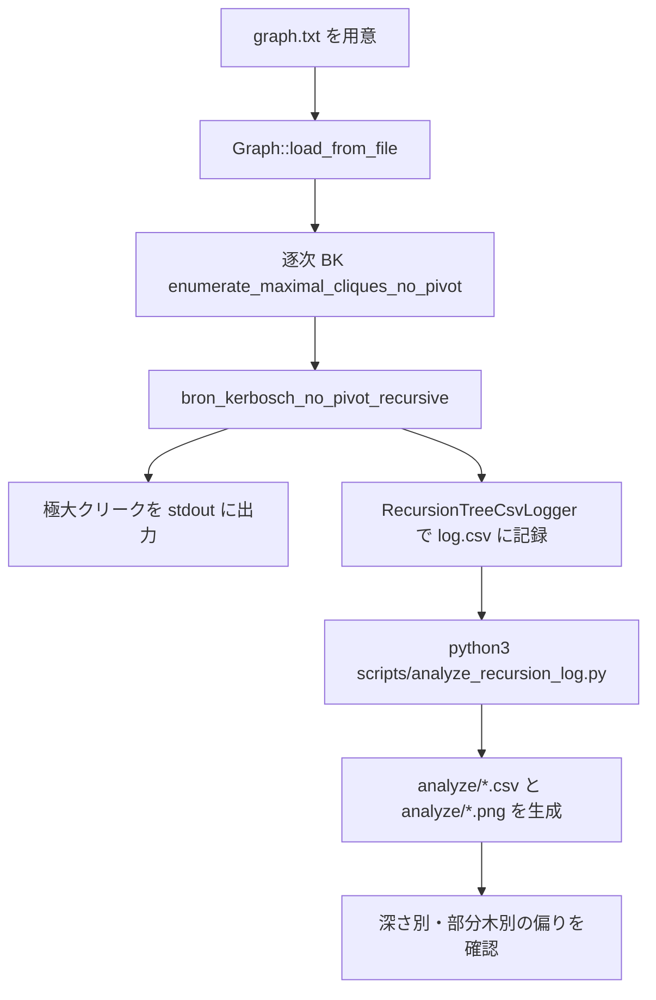

# 逐次BK解析報告書

この文書は、このリポジトリで `graph.txt` を読み込み、逐次 Bron–Kerbosch 法（以下 BK）を実行し、`log.csv` を書き出し、Python で解析するまでの一連の流れを、人に説明できるレベルでまとめた報告書である。

目的は次の 3 つである。

1. どのファイルが何をしているかを明確にする。
2. 逐次 BK の内部で `R/P/X` がどう動くかを理解する。
3. 生成された CSV と図が何を意味するかを説明できるようにする。

---

## 1. 全体の流れ



この流れで重要なのは、BK の正しさ確認と、再帰木の観測を分けて考える点である。まず逐次 BK が正しい極大クリークを出すことを確かめ、そのあとにログを解析して探索木の偏りを観測する。

---

## 2. 今回使うファイル一覧

この流れで直接関係するファイルを、役割ごとに列挙する。

### 入力・出力

- `graph.txt`
  - BK に渡すグラフ入力。
  - 1 行目が頂点数、2 行目以降が無向辺 `u v`。
- `log.csv`
  - BK の再帰木ログ。
  - 1 再帰呼び出しにつき 1 行。
- `analyze/depth_summary.csv`
  - 深さごとのノード数と `elapsed_us` 合計。
- `analyze/depth_subtree_summary.csv`
  - 深さごとの部分木集計。
- `analyze/top_nodes.csv`
  - 部分木コスト上位ノード。
- `analyze/node_subtree_summary.csv`
  - 全ノードの部分木集計。
- `analyze/*.png`
  - Python で作る図。

### 実行の中心となるソースコード

- `src/maximal_clique_bk.cpp`
  - 逐次 BK の実行ファイル本体。
  - 入力を読み、BK を呼び、極大クリークとログを出力する。
- `include/exp/bron_kerbosch.hpp`
  - BK 再帰そのもの。
  - `R/P/X` の更新、極大判定、再帰木ログ記録を行う。
- `include/exp/graph.hpp`
  - グラフ読込と隣接情報の管理。
- `include/exp/bitset.hpp`
  - `P` と `X` の集合演算を高速に行うビット集合。
- `include/exp/recursion_tree_logger.hpp`
  - 再帰木の 1 ノード分の記録形式と CSV 書き込み。
- `include/exp/logger.hpp`
  - CSV を安全に書く共通クラス。
- `scripts/analyze_recursion_log.py`
  - `log.csv` を読み、深さ別・部分木別に集計し、CSV と PNG を出す。

### 補助・周辺資料

- `CMakeLists.txt`
  - `maximal_clique_bk` ターゲットを定義する。
- `docs/experiment_playbook.md`
  - 実験順の手順書。
- `docs/recursion_tree_logging.md`
  - 再帰木ログの設計書。
- `README.md`
  - 実行例・解析例の入口。

---

## 3. グラフ入力 `graph.txt` の読み方

`graph.txt` は次の形式で読む。

```text
N
u v
u v
...
```

### 今回の例

```text
5
0 1
0 2
1 2
2 3
3 4
```

これは次の構造を表す。

- 0, 1, 2 が三角形
- 2 と 3 が接続
- 3 と 4 が接続

このとき極大クリークは次の 3 つになる。

- `0 1 2`
- `2 3`
- `3 4`

ここで重要なのは、`2 3` や `3 4` は「小さい」クリークだが、これ以上 1 頂点足せないので極大である点である。

---

## 4. 実行ファイル `src/maximal_clique_bk.cpp`

このファイルは、逐次 BK を動かすためのエントリポイントである。

### 主な役割

1. コマンドライン引数を読む。
2. `graph.txt` を `Graph::load_from_file` で読む。
3. 必要なら `RecursionTreeCsvLogger` を作る。
4. `enumerate_maximal_cliques_no_pivot` を呼ぶ。
5. 見つけた極大クリークを標準出力に出す。
6. `count=` を出力する。

### 実際の使い方

```bash
./build/maximal_clique_bk graph.txt
./build/maximal_clique_bk graph.txt log.csv
./build/maximal_clique_bk graph.txt log.csv --show-clique
```

### このファイルで理解すべき点

- `argv[1]` が入力グラフ。
- `argv[2]` がログファイル。
- `--show-clique` を付けると `clique_vertices` も CSV に出る。
- ログを付けない場合は逐次 BK の結果だけ出す。

このファイル自体は薄い。実際の探索は `bron_kerbosch.hpp` にある。

---

## 5. 逐次 BK 本体 `include/exp/bron_kerbosch.hpp`

ここが最重要である。BK の再帰構造、`R/P/X` の更新、極大判定、ログ記録が全部ここにある。

### 5.1 BK の基本概念

BK では 3 つの集合を持つ。

- `R` : すでに選んだ頂点集合。現在の部分クリーク。
- `P` : まだ試せる候補。
- `X` : すでに別枝で試した頂点。

この実装では `Clique current` が `R` に相当し、`Bitset p` が `P`、`Bitset x` が `X` である。

### 5.2 再帰の流れ

```cpp
void bron_kerbosch_no_pivot_recursive(...)
```

この関数が 1 ノードの再帰呼び出しを表す。

処理の順番は次の通り。

1. `start_time` を取る。
2. `node_id` を発行する。
3. `candidates = p.indices()` で候補を列挙する。
4. `p_size`, `x_size` を記録する。
5. `is_leaf = p.none() && x.none()` を判定する。
6. 葉なら `callback(current)` で極大クリークを出力する。
7. 葉でなければ候補を 1 つずつ試す。
8. `next_p = p & neighbors[vertex]`、`next_x = x & neighbors[vertex]` で次の集合を作る。
9. 子を再帰呼び出しする。
10. 子を全部処理した後に `logger->write_node(...)` で記録する。

### 5.3 重要な実装ポイント

- `current.push_back(vertex)` で `R` を拡張する。
- `current.pop_back()` で元に戻す。
- `p.reset(vertex)` と `x.set(vertex)` により、今試した頂点を `P` から `X` に移す。
- `child_count` は実際に呼んだ子の個数である。
- `candidate_count` はそのノードで `P` から取り出した候補数である。

### 5.4 `elapsed_us` の意味

`elapsed_us` は、そのノードに入ってから戻るまでの総時間である。つまりその 1 ノードの自己時間と子孫処理を含む「その再帰呼び出し全体の時間」である。

### 5.5 `node_id` が順番どおりに見えない理由

`node_id` は発行順だが、CSV に書くのは再帰が終わった後である。したがって出力順は深いノードから先に出る post-order になる。根は最後に出る。

### 5.6 `clique_vertices` の意味

`--show-clique` を付けた場合だけ、現在の `current` を空白区切りで書いた列が追加される。

- これは `R` の頂点列そのもの。
- デフォルトでは出さない。
- 大きいグラフでは冗長になるので、必要なときだけ有効にする。

### 5.7 関数ごとの役割

- `clique_to_string`
  - `current` を CSV に書ける文字列に変換する。
- `bron_kerbosch_no_pivot_recursive`
  - 逐次 BK の本体。
- `enumerate_maximal_cliques_no_pivot`
  - グラフ全体の初期化と再帰開始。
- `bron_kerbosch_no_pivot_task_recursive`
  - OpenMP task 版の再帰。
  - 今回の逐次解析の主対象ではないが、同じ基盤を使う。
- `enumerate_maximal_cliques_no_pivot_task_parallel`
  - OpenMP を使ったタスク並列版。

---

## 6. グラフ構造 `include/exp/graph.hpp`

このファイルは、入力ファイルを `Graph` に変換する。

### 主な役割

- 頂点数を持つ。
- 隣接リストを持つ。
- 辺を追加する。
- 近傍をビット集合に変換する。

### `load_from_file` の意味

```cpp
static Graph load_from_file(const std::string& path)
```

この関数は `graph.txt` を読んで `Graph` を作る。

処理の流れ:

1. ファイルを開く。
2. 1 行目の頂点数を読む。
3. `Graph graph(vertex_count)` を作る。
4. 以降の `u v` を `add_edge` で追加する。
5. `sort_and_unique()` で整列・重複除去する。

### `add_edge`

- 自己ループ `u == v` は捨てる。
- 範囲外の頂点も捨てる。
- 無向グラフなので両方向に追加する。

### `neighbor_bitset`

BK では `P & neighbors[vertex]` のような交差計算を頻繁に行う。そのため、各頂点の近傍を `Bitset` に変換して使う。

---

## 7. 高速な集合演算 `include/exp/bitset.hpp`

BK の中心は集合演算である。`Bitset` はそのための軽量なビット集合実装である。

### 何をしているか

- `set`, `reset`, `test`
- `any`, `none`, `count`
- `indices`
- `operator&`, `operator|`, `operator^`
- `intersects`

### BK での使い方

- `p & neighbors[vertex]`
  - `P` とその頂点の近傍の交差。
- `x & neighbors[vertex]`
  - `X` とその頂点の近傍の交差。

### `indices()` の意味

`P` に入っている頂点を順番に取り出す。BK では候補を列挙するためにこれを使っている。

### `count()` の意味

ビット 1 の個数。`p_size` と `x_size` の計算に使う。

### この実装の意味

`Bitset` によって、`P` と `X` の交差計算を頂点単位のループより効率的に処理している。並列化実験でも土台になる重要な部品である。

---

## 8. CSV ログ `include/exp/recursion_tree_logger.hpp`

ここは再帰木 1 ノード分の記録を定義する。

### `RecursionTreeNodeRecord`

主な項目:

- `node_id`
- `parent_id`
- `depth`
- `clique_size`
- `clique_vertices`
- `p_size`
- `x_size`
- `candidate_count`
- `child_count`
- `elapsed_us`
- `is_leaf`

### `kNoParentNode`

根ノードの親が存在しないことを表す sentinel 値で、`size_t` の最大値を使っている。

### `RecursionTreeCsvLogger`

このクラスは CSV のヘッダ行と各ノード行を出力する。

重要な点:

- `include_clique_vertices_` が `true` のときだけ `clique_vertices` 列を増やす。
- そうでないときは従来の 10 列 CSV のまま。
- 既存の解析を壊さないように、出力形式を切り替え可能にしている。

### `next_node_id()`

再帰ノードを連番で採番する。

### `write_node()`

1 ノード分の記録を 1 行で書く。

### `flush()`

ファイルを確実に書き出す。

---

## 9. CSV 出力の共通部品 `include/exp/logger.hpp`

このクラスは一般的な CSV 書き込みを担当する。

### 主な役割

- ファイルを開く。
- ヘッダ行を書く。
- 各行を CSV 形式で書く。
- 必要なら引用符を適切にエスケープする。

### 重要な点

- `append` を指定しないと基本は上書き。
- カンマや改行を含む値は必要に応じて引用符で囲う。
- `enabled=false` なら何も書かない。

BK のログ機能は、この共通クラスの上に乗っている。

---

## 10. Python 解析 `scripts/analyze_recursion_log.py`

このスクリプトは `log.csv` を集計して、実験で使いやすい形に変換する。

### 入力

- `log.csv`

### 出力先

- デフォルトは `analyze/`
- `--output-dir` で変更可能

### 処理の流れ

1. CSV を読む。
2. `parent_id` を正規化する。
3. 親子関係を復元する。
4. 子から親へ部分木時間を集計する。
5. 深さ別にノード数と時間を集計する。
6. いくつかの CSV を書く。
7. `matplotlib` があれば PNG も書く。

### `read_log`

- 1 行ごとにノード情報を辞書化する。
- `parent_id == -1` または sentinel の大きな値は root として扱う。

### `compute_subtree_elapsed`

ここが重要である。

- root から始めて post-order にノードをたどる。
- 子ノードの `subtree_elapsed` を親に足し込む。
- 各ノードについて以下を作る。
  - `subtree_elapsed`
  - `descendant_elapsed_us`
  - `subtree_node_count`
  - `descendant_node_count`
  - `self_time_share`

`self_time_share` は「そのノード自身の時間が、部分木全体に対してどれくらいか」を表す。

### `summarize`

深さごとに以下を集計する。

- ノード数
- `elapsed_us` 合計
- `subtree_elapsed` 合計
- `descendant_elapsed` 合計

### 出力する CSV

- `depth_summary.csv`
  - 深さごとのノード数と時間。
- `depth_subtree_summary.csv`
  - 深さごとの部分木時間。
- `top_nodes.csv`
  - 重い部分木の上位。
- `node_subtree_summary.csv`
  - 全ノードの詳細集計。

### 図の意味

- `depth_distribution.png`
  - 深さとノード数・時間の分布。
- `top_subtree_elapsed.png`
  - 重い部分木の上位棒グラフ。
- `depth_subtree_elapsed.png`
  - 深さごとの部分木時間の比較。

### コンソール出力の意味

- `nodes: 12`
  - 読み込んだノード数。
- `total elapsed_us: 218`
  - 全ノードの `elapsed_us` 合計。
- `... written to ...`
  - 出力ファイルの保存先。

---

## 11. 解析結果の読み方

今回の小さい例では、極大クリークは 3 個である。

- `0 1 2`
- `2 3`
- `3 4`

### `log.csv` の見方

- `node_id` は再帰呼び出しの通し番号。
- `parent_id` は親ノード。
- `depth` は再帰の深さ。
- `clique_size` は現在の `R` のサイズ。
- `p_size` と `x_size` は候補と除外の大きさ。
- `is_leaf=1` の行が極大クリークである。

### `clique_vertices` があると何が良いか

`--show-clique` を付けると、`R` の実体が CSV に残る。

- 小さい例では、どの行が `0 1 2` なのかを直接読める。
- 大きい例では冗長になるので、必要時のみ使うのがよい。

### 今回のログの重要な理解ポイント

- `0, -1, 0, ...` は root である。
- 末尾に root が来るのは、再帰終了後にログを書くからである。
- `elapsed_us` はノード単位の時間であり、子孫を含む部分木時間ではない。
- 部分木時間は Python 側で復元している。

---

## 12. 関連する補助文書

この報告書とあわせて読むと理解が速い文書は次の 3 つである。

- `docs/recursion_tree_logging.md`
  - 再帰木ログの設計意図と更新ルール。
- `docs/experiment_playbook.md`
  - 逐次 BK から MPI までの実験順。
- `README.md`
  - 実行コマンドと解析コマンドの入口。

---

## 13. この流れを口頭で説明するなら

短く言うと、次のようになる。

1. `graph.txt` でグラフを用意する。
2. `Graph::load_from_file` でグラフを読み込む。
3. `bron_kerbosch_no_pivot_recursive` が `R/P/X` を更新しながら探索する。
4. 極大クリークは標準出力に出る。
5. 再帰木は `log.csv` に 1 ノード 1 行で残る。
6. `analyze_recursion_log.py` がその CSV を深さ別・部分木別に集計する。
7. `analyze/*.csv` と `analyze/*.png` で偏りを確認する。

この 7 点を押さえておけば、逐次 BK の実行から解析までを説明できる。
